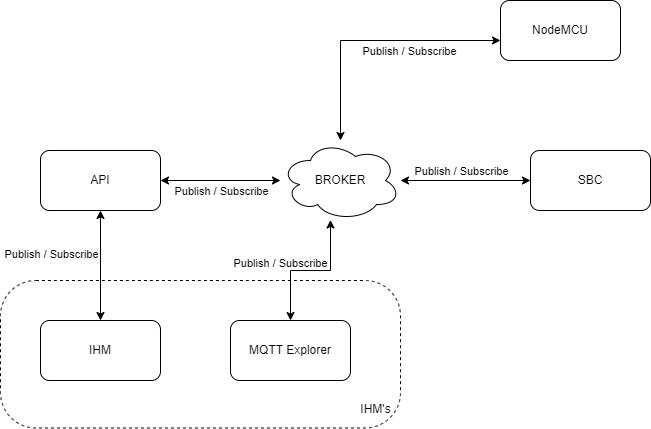
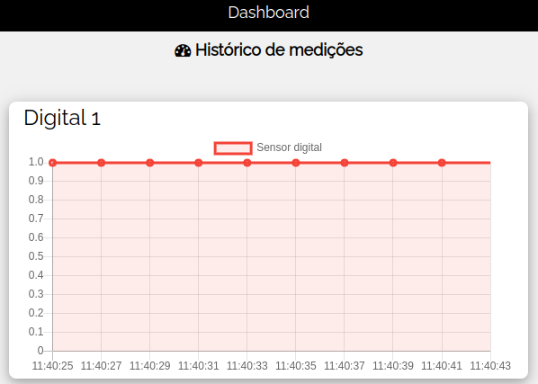
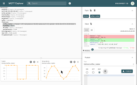

# IoTPlatform

<details>
<summary>Texto do Problema</summary>

---

## Tema

Protótipo de um sistema IoT.

## Objetivos de Aprendizagem

Ao final da realização deste problema, o/a discente deverá ser capaz de:

- Entender como integrar sensores com aplicações através do protocolo MQTT;
- Compreender o uso e funcionalidades do protocolo MQTT;
- Assimilar conceitos básicos sobre integração de sistemas.

## Problema

No problema anterior foi implementado um protótipo de sistema de sensoriamento genérico. Como na fase de protótipo foi utilizada uma plataforma baseada na NodeMCU, que possui interface de comunicação sem fio, agora lhe é solicitado o desenvolvimento de um sistema com sensores sem fio.

Neste problema, o sistema continuará comandado pelo Single Board Computer (SBC), e todos os requisitos anteriormente solicitados para o sistema com a UART devem ser atendidos. MI - Sistemas Digitais (2022.2) 1 O protótipo atual deve incluir agora uma IHM (Interface Homem-Máquina) para apresentação das informações, em tempo real, das leituras atuais dos sensores. Ela também deve permitir a visualização do histórico com as 10 últimas medições de cada sensor, preferencialmente na forma de um gráfico temporal. Além disso, a IHM deve ser usada para o ajuste local e remoto do intervalo de tempo em que serão realizadas as medições

Finalmente, o SBC também deverá ser utilizado como centralizador das informações para que os dados possam ser acessados através da internet.

---

</details>

## Autores
<div align="justify">
    <li><a href="https://github.com/ozenilsoncruz">@Ozenilson Cruz</a></li>  
    <li><a href="https://github.com/traozin">@Antônio Neto</a></li>
</div>

### Requisitos 

O hardware usado no teste foi uma Orange Pi e uma NodeMCU ESP-8266

- **Orange Pi** [^orange]
  - CPU - H3 Quad-core Cortex-A7 H.265/HEVC 4K
  - GPU	- Mali400MP2 GPU @600MHz
  - Memory (SDRAM)	1GB DDR3 (shared with GPU)
  - 8GB eMMC Flash

- **NodeMCU ESP-8266** [^nodemcu]
  - Módulo NodeMcu Lua ESP-12E
  - Memória flash: 4 MB
  - Wireless padrão 802.11 b/g/n
  - Antena embutida
  - Suporta 5 conexões TCP/IP
  - Portas GPIO: 13
  - D0 (GPIO16) só pode ser usado como entrada ou saída, não suporta outras funções (interrupção, PWM, I2C, etc)

### Instruções para instalação

Esse projeto necessita que o usuário tenha a IDE do Arduino instalada em sua máquina, necessária para comunicação com a NodeMCU. Para isso, siga as instruções do link abaixo:

<details>
<summary>Configuração do ambiente arduino</summary>

- Siga os passos para fazer a [Instalação do Arduino IDE](https://www.arduino.cc/en/Guide/Windows#toc4).
- Siga os passos para fazer a [Instalação do Driver da NodeMCU](https://www.blogdarobotica.com/2020/05/26/instalando-driver-serial-para-nodemcu-com-chip-ch340/).
- Siga os passos para [Adicionar Bibliotecas na IDE Arduino](https://www.robocore.net/tutoriais/adicionando-bibliotecas-na-ide-arduino#:~:text=Dispon%C3%ADvel%20na%20IDE%20do%20Arduino,Include%20Library). Adicione as bibliotecas [^PubSubClient] [^Timer].
- Instale as bibliotecas [^wiri] [^paho] na sua SBC.
</details>

##### Após configuração do ambiente, siga os passos abaixo:
**1.** Baixe o arquivo `main_esp.ino` e faça upload para o NodeMCU.
**2.** Faça as devidas configurações de Broker e rede no arquivo `main_esp.ino`.
**3.** Em uma Orange Pi e em um computador pessoal, clone o repositório.
   ```sh
   git clone https://github.com/ozenilsoncruz/IoMQTT
   ```
**4.** Na  Orange Pi utilizando o terminal, navegue para a pasta do repositório e execute os passos abaixo: 
  - Faça as devidas configurações de Broker no arquivo `mqtt_sbc.h`.
  - Compile utilizando o Makefile com o comando:
    ```sh
        make
    ```
  - Execute com o comando:
    ```sh
        sudo ./main
    ```
**5.** Para visualização dos resultados, existem duas formas:
  - **Visualização no MQTT Explorer**: 
    - Para a visualização, baixe o [MQTT Explorer](https://mqtt-explorer.com/) e execute os passos abaixo:
      1. Conecte na mesma rede em que seu Broker estiver em execução.      
      2. Execute o MQTT Explorer e faça a conexão com o Broker.
  - **Visualização na IHM**:
    - Para a visualização, navegue para a pasta do repositório e execute os passos abaixo:
      1. Faça as devidas configurações de Broker no arquivo `ihm.py`.
      2. Execute com o comando:
        ```sh
            python3 -m pip install -r requirements.txt 
        ```
      3. Execute o script `ihm.py`:
        ```sh
            python3 ihm.py 
        ```

## Protocolo MQTT [^MQTT1] [^MQTT2]

MQTT é um protocolo de mensagens padrão OASIS para a Internet das Coisas (IoT). Ele foi projetado como um transporte de mensagens de publicação/assinatura extremamente leve, ideal para conectar dispositivos remotos com um pequeno volume de código e largura de banda de rede mínima. Hoje, o MQTT é usado em uma ampla variedade de indústrias, como automotiva, manufatura, telecomunicações, petróleo e gás, etc. O formato utilizado no MQTT é de Cliente/Servidor.

#### Como funciona ?

Para funcionar, o Protocolo MQTT utiliza um modelo de Publish/Subscribe onde permite que o cliente faça postagens e/ou capte informações enquanto o servidor irá administrar esse envio e o recebimento dos respectivos dados.

Ou seja, em um MQTT haverá um publicador onde será responsável por publicar as mensagens em um determinado tópico onde um assinante irá inscrever-se neste tópico para poder acessar a mensagem.

Como não há uma conexão direta entre o assinante e o publicador, para que essas mensagens aconteçam, o protocolo MQTT irá precisar de um gerenciador de mensagens chamado de Broker.

#### Formas de comunicação

Em um Protocolo MQTT, a publicação e o recebimento de dados são realizados através de um tipo de servidor chamado de Broker. Ou seja, nessa comunicação haverá então um cliente que terá o papel de Publisher (Publicador) e transmitirá a mensagem, com um tópico de destino e o seu Payload (o conteúdo da mensagem).

Esta mensagem será então encaminhada ao Broker, que se encarregará de gerenciá-la e entregá-la ao Participante que anteriormente se inscreveu no tópico.

Na mesma linha, se um cliente pretender tornar-se subscritor de um tópico, apenas terá de passar o pedido ao Broker, que poderá estabelecer uma ligação entre o cliente e o tópico em questão.

De forma simplificada, essa comunicação pode ser dividida entre os seguintes termos:

- **Subscriber** (Subscrito) – a pessoa que estará inscrita no tópico e irá ter o papel de receptor.
- **Publisher** (Publicador) – a pessoa que estará responsável por ser o emissor e enviar os dados para um determinado tópico.
- **Broker** – será o intermediário para fazer uma ponte de comunicação entre o Publisher e o Subscriber, se tornando responsável por fazer o recebimento, enfileiramento e envio das mensagens.
- **Tópico** –será o endereço pelo qual os dados das mensagens serão enviados.
- **Client** (Cliente) – será o elemento que terá a capacidade de interagir com o Broker, podendo enviar e receber dados.
- **Mensagem** – será o pacote de dados trocados entre os clientes e o Broker.
- **Unsubscribe** – permite deixar de assinar um determinado tópico.
- **Payload** – será o conteúdo da mensagem que será enviada.

<p align="center"></p>
<p align="center"> Figura 1. Diagrama do projeto</p>

### Comunicação MQTT na SBC

A comunicação via MQTT ma SBC foi desenvolvida na linguagem C utilizando a biblioteca Paho MQTT. 

O método *on_message()* é responsável por receber e tratar as mensagens de diferentes tópicos. Cada tópico é responsável por uma função especifica, são elas:

<table class="tg" align= "center">
<thead>
  <tr>
    <th class="tg-amwm">Tópico</th>
    <th class="tg-amwm">Função<br></th>
  </tr>
</thead>
<tbody>
  <tr>
    <td class="tg-baqh">esp/analog_sensor</td>
    <td class="tg-baqh">Recebe o valor da entrada analógica</td>
  </tr>
  <tr>
    <td class="tg-baqh">esp/digital_sensor</td>
    <td class="tg-baqh">Recebe o valor da entrada digital</td>
  </tr>
  <tr>
    <td class="tg-baqh">esp/led</td>
    <td class="tg-baqh">Recebe o estado do LED</td>
  </tr>
  <tr>
    <td class="tg-baqh">esp/sensores_analogicos</td>
    <td class="tg-baqh">Recebe o valor da entrada analógica</td>
  </tr>
  <tr>
    <td class="tg-baqh">esp/sensores_digitais</td>
    <td class="tg-baqh">Recebe o valor de todas as entradas digitais</td>
  </tr>
  <tr>
    <td class="tg-baqh">esp/status</td>
    <td class="tg-baqh">Recebe o status da NodeMCU</td>
  </tr>
  <tr>
    <td class="tg-baqh">ihm/tempo</td>
    <td class="tg-baqh">Recebe o novo tempo para de atualização para NodeMCU</td>
  </tr>
</tbody>
</table>
<p align="center">Tópicos de resposta para SBC</p>

```c
/**
 * Recebe as mensagens dos topicos inscritos
 * @param context - 
 * @param topicName - Nome do topico que mando a mensagem 
 * @param topicLen  - Tamamnho do nome do topico
 * @param mensagem - Mensagem recebida
 */
int on_message(void *context, char *topicName, int topicLen, MQTTClient_message *message) {
    char* payload = message->payload;
    
    printf("\n\nMensagem recebida! \n\rTopico: %s Mensagem: %s\n\n\n", topicName, payload);

    if(strcmp(topicName, LED) == 0){
        if(strcmp(payload, "1") == 0){
            write_textLCD("      MQTT     ", "LED: ON");
        }
...

}
```

Todas as interações na SBC são realizadas por meio de botões e as saídas são exibidas no display LCD.

### Comunicação MQTT na NodeMCU [^PubSubClient]

Na NodeMCU a comunicação via MQTT foi construida utilizando a biblioteca PubSubClient mo arduino. Os métodos utilizados foram:
- *publish()*:  Publica uma mensagem no tópico especificado.. 
- *on_message()*: Recebe as informações e trata os dados recebidos por tópico. Esta função é chamada quando novas mensagens chegam ao cliente.
- *setCallback()*: Define a função de retorno de chamada da mensagem.

No código abaixo temos um exemplo da utilização de alguns desses métodos. O *publish()* publica a resposta a requisição , *on_message()* é executada continuamente dentro do *setCallback()*.

```cpp
/**
 * Recebe as mensagens via mqtt 
 * @param topic - Topico que enviou a mensagem
 * @param payload - Mensagem recebida
 * @param length - Tamanho da mensagem
*/
void on_message(char* topic, byte* payload, unsigned int length){
  String msg;
  if(length > 0){
    for(int i = 0; i < length; i++) {
      char c = (char)payload[i];
      msg += c;
    }
    if(msg[0] == '3'){
      MQTT.publish(STATUS, "00");
    }
...
}

...

  MQTT.setCallback(on_message);

...
```

##### Mensagens automáticas na NodeMCU [^Timer]

A NodeMCU envia mensagens automáticamente para sbc em um intervalo de tempo definido. Essa mensagem contém as saídas de todos os sensores e pode ser alterada em um intervalo de 1 a 10 segundos, minutos ou horas.

Para isso, uma biblioteca chamada Timer foi instalada e com ela é possivel definir um intervalo de tempo em que um método especificado será acionado. Abaixo temos um exemplo de sua utilização no código.

```cpp

...

  t.stop(0); // para a execucao do metodo
  t.every(tempo_medicoes * 1000, medicoes); // seta o novo tempo (em ms) * 1000

...
```

### Comunicação MQTT na IHM

Para a IHM foi produzida uma API utilizando a linguagem Python com as bibliotecas Flask e Flask MQTT. A API é capaz de gerar receber e enviar dados via MQTT, mas não consegue realizar os devidos tratamentos dos dados para serem exibidos nos gráficos de mais de um sensor. A figura 2 mostra o gráfico com os dados de um sensor digital da interface web desenvolvida.

<p align="center"></p>
<p align="center"> Figura 2. Gráfico da IHM remota </p>

Por esse motivo, um software chamado de MQTT Explorer foi utilizado para gerar gráficos sobre as ultimas medições dos sensores da nodeMCU. A figura 3 mostra a interface do software MQTT explores e como os dados podem ser visualizados em um gráfico.

<p align="center"></p>
<p align="center"> Figura 3. Interface do MQTT Explorer com gráficos </p>

## Testes

Para averiguar o funcionamento correto do projeto implementado os seguintes testes foram realizados:

- Solicitação do status da NodeMCU;
- Envio de uma mensagem não esperada pela NodeMCU;
- Acendimento e apagamento do LED múltiplas vezes;
- Verificação da veracidade dos dos dados no histórico;
- Verificação do intervalo de tempo dos estados dos pinos automaticamente;
- Solicitação do valor das entradas digitais múltiplas vezes enquanto o valor do pino é alterado;
- Solicitação do valor da entrada analógica múltiplas vezes enquanto o valor do pino é alterado;


## Conclusão
Por meio deste projeto, conceitos importantes de comunicação mqtt foram devidamente incorporados e compreendidos para a solução, bem como a utilidade da utilização de microcontroladores para diversos tipos de aplicações. 

O código deste projeto é capaz de resolver o problema apresentado utilizando de bibliotes nativas das linguagens C e Arduino. Toda via, algumas das soluções podem não apresentar o melhor funcionamento possível pois nem todas foram devidamente testadas.

| :arrow_left: [Problema anterior](https://github.com/traozin/IOInterface) |.............................................. :arrow_up: [Voltar ao topo](#IoTPlatform) :arrow_up: .............................................| 
| :----: |-----|


[^MQTT1]: Protocolo MQTT: O Que é, Como Funciona e Vantagens - [automacaoindustrial.info](https://www.automacaoindustrial.info/mqtt/l)

[^MQTT2]: MQTT: The Standard for IoT Messaging - [mqtt.org](https://mqtt.org/)

[^nodemcu]: NodeMCU ESP8266-12 V2 Especificações - [robocore.net](https://www.robocore.net/wifi/nodemcu-esp8266-12-v2)

[^orange]: Orange Pi PC Plus - [orangepi.org](http://www.orangepi.org/html/hardWare/computerAndMicrocontrollers/details/Orange-Pi-PC-Plus.html)

[^PubSubClient]: Biblioteca Arduiono PubSubClient - [arduino.cc](https://www.arduino.cc/reference/en/libraries/pubsubclient/)

[^Timer]: Biblioteca Arduiono Timer - [playground.arduino.cc](https://playground.arduino.cc/Code/Timer/#Installation)

[^wiri]: Biblioteca C WiringPi - [wiringpi.com](http://wiringpi.com/)

[^paho]: Biblioteca C Paho MQTT - [github.com/eclipse/paho.mqtt.c](https://github.com/eclipse/paho.mqtt.c/blob/master/src/MQTTClient.h)